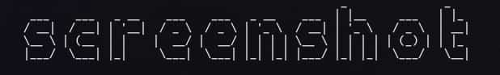

<<<<<<< HEAD
<div align = "center">

<h1><a href="https://github.com/2kabhishek/exercism-fetcher">exercism-fetcher</a></h1>

<a href="https://github.com/2KAbhishek/exercism-fetcher/blob/main/LICENSE">
 </a>

<a href="https://github.com/2KAbhishek/exercism-fetcher/graphs/contributors">
 </a>

<a href="https://github.com/2KAbhishek/exercism-fetcher/stargazers">
</a>

<a href="https://github.com/2KAbhishek/exercism-fetcher/network/members">
 </a>

<a href="https://github.com/2KAbhishek/exercism-fetcher/watchers">
 </a>

<a href="https://github.com/2KAbhishek/exercism-fetcher/pulse">
 </a>

<h3>Short Sweet Headline 🎇🎉</h3>

<figure>
  
  <br/>
  <figcaption>exercism-fetcher in action</figcaption>
</figure>

</div>

exercism-fetcher is a `<utility/tool>` that allows `<target_audience>` to `<action>`.

## ✨ Features

- Comes with a ready to go README template
- Works with [mkrepo](https://github.com/2kabhishek/mkrepo)

## ⚡ Setup

### ⚙️ Requirements

- foo >= bar
- bazz

### 💻 Installation

Installing exercism-fetcher is as simple as cloning and symlinking!

```bash
git clone https://github.com/2kabhishek/exercism-fetcher
cd exercism-fetcher
<install_command>
```

## 🚀 Usage

```bash
USAGE:
    exercism-fetcher [FLAGS] [OPTIONS]
Example:
    exercism-fetcher
```

## 🏗️ What's Next

Planning to add `<feature/module>`.

### ✅ To-Do

- [x] Setup repo
- [ ] Think real hard
- [ ] Start typing

## 🧑‍💻 Behind The Code

### 🌈 Inspiration

exercism-fetcher was inspired by `<reason/idea>`.

### 💡 Challenges/Learnings

- The main challenges were `<issue/difficulty>`
- I learned about `<learning/accomplishment>`

### 🧰 Tooling

- [dots2k](https://github.com/2kabhishek/dots2k) — Dev Environment
- [nvim2k](https://github.com/2kabhishek/nvim2k) — Personalized Editor
- [sway2k](https://github.com/2kabhishek/sway2k) — Desktop Environment
- [qute2k](https://github.com/2kabhishek/qute2k) — Personalized Browser

### 🔍 More Info

- [shelly](https://github.com/2kabhishek/shelly) — Command line template
- [tiny-web](https://github.com/2kabhishek/tiny-web) — Web app template

<hr>

<div align="center">

<strong>⭐ hit the star button if you found this useful ⭐</strong><br>

<a href="https://github.com/2KAbhishek/exercism-fetcher">Source</a>
| <a href="https://2kabhishek.github.io/blog" target="_blank">Blog </a>
| <a href="https://twitter.com/2kabhishek" target="_blank">Twitter </a>
| <a href="https://linkedin.com/in/2kabhishek" target="_blank">LinkedIn </a>
| <a href="https://2kabhishek.github.io/links" target="_blank">More Links </a>
| <a href="https://2kabhishek.github.io/projects" target="_blank">Other Projects </a>

</div>
||||||| (empty tree)
=======
# Exercism::Fetcher

TODO: Delete this and the text below, and describe your gem

Welcome to your new gem! In this directory, you'll find the files you need to be able to package up your Ruby library into a gem. Put your Ruby code in the file `lib/exercism/fetcher`. To experiment with that code, run `bin/console` for an interactive prompt.

## Installation

TODO: Replace `UPDATE_WITH_YOUR_GEM_NAME_PRIOR_TO_RELEASE_TO_RUBYGEMS_ORG` with your gem name right after releasing it to RubyGems.org. Please do not do it earlier due to security reasons. Alternatively, replace this section with instructions to install your gem from git if you don't plan to release to RubyGems.org.

Install the gem and add to the application's Gemfile by executing:

    $ bundle add UPDATE_WITH_YOUR_GEM_NAME_PRIOR_TO_RELEASE_TO_RUBYGEMS_ORG

If bundler is not being used to manage dependencies, install the gem by executing:

    $ gem install UPDATE_WITH_YOUR_GEM_NAME_PRIOR_TO_RELEASE_TO_RUBYGEMS_ORG

## Usage

TODO: Write usage instructions here

## Development

After checking out the repo, run `bin/setup` to install dependencies. Then, run `rake spec` to run the tests. You can also run `bin/console` for an interactive prompt that will allow you to experiment.

To install this gem onto your local machine, run `bundle exec rake install`. To release a new version, update the version number in `version.rb`, and then run `bundle exec rake release`, which will create a git tag for the version, push git commits and the created tag, and push the `.gem` file to [rubygems.org](https://rubygems.org).

## Contributing

Bug reports and pull requests are welcome on GitHub at https://github.com/[USERNAME]/exercism-fetcher. This project is intended to be a safe, welcoming space for collaboration, and contributors are expected to adhere to the [code of conduct](https://github.com/[USERNAME]/exercism-fetcher/blob/main/CODE_OF_CONDUCT.md).

## Code of Conduct

Everyone interacting in the Exercism::Fetcher project's codebases, issue trackers, chat rooms and mailing lists is expected to follow the [code of conduct](https://github.com/[USERNAME]/exercism-fetcher/blob/main/CODE_OF_CONDUCT.md).
>>>>>>> d30667d (init: boilerplate with bundle)
